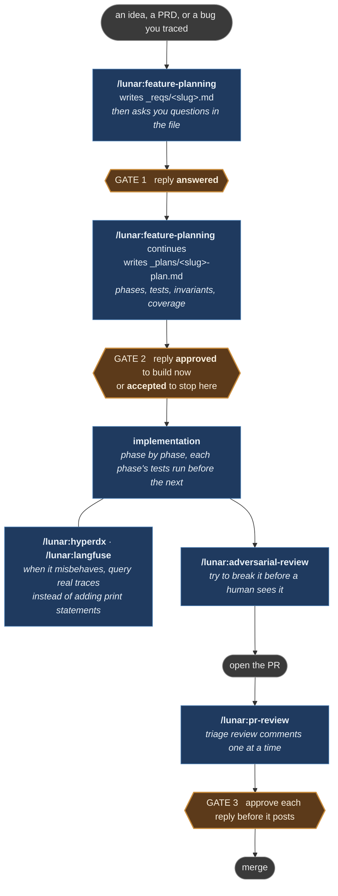

# Claude Skills Toolkit

A complete, working [Claude Code](https://claude.com/claude-code) setup for
building AI agents locally — with the observability, planning discipline, and
review depth you'd usually only have in production.

The approach is **prod-local**: run the same observability stack on your machine
that you'd run in production, so debugging an agent means querying real traces
and logs instead of adding print statements. Around that sit a plan-first
workflow with explicit human gates, and a review pass that reasons about the
whole system rather than just the diff.

It's a system, not a pile of prompts — the skills, the workflow they assume, and
the settings that let them run cleanly are built to fit together. Install it in
one command and you get the whole setup; take any single piece on its own if
that's all you want.

## Contents

- [How the skills fit together](#how-the-skills-fit-together)
- [What's inside](#whats-inside)
- [Prerequisites](#prerequisites)
- [Install](#install) — [from GitHub](#from-github),
  [from a local clone](#from-a-local-clone)
- [Per-project setup](#per-project-setup)
- [Running the scripts without a prompt each time](#running-the-scripts-without-a-prompt-each-time)
- [What an adversarial review costs](#what-an-adversarial-review-costs)
- [When *not* to use this](#when-not-to-use-this)
- [Things that surprise people](#things-that-surprise-people)
- [Never do this](#never-do-this)
- [How a skill works](#how-a-skill-works)

## How the skills fit together

Each skill stands alone, but they were built as one loop: decide, build, break
it yourself, then answer the humans.


```mermaid
flowchart TD
    idea(["an idea, a PRD, or a bug you traced"])
    fp1["<b>/lunar:feature-planning</b><br/>writes _reqs/&lt;slug&gt;.md<br/><i>then asks you questions in the file</i>"]
    g1{{"GATE 1 &nbsp; reply <b>answered</b>"}}
    fp2["<b>/lunar:feature-planning</b> continues<br/>writes _plans/&lt;slug&gt;-plan.md<br/><i>phases, tests, invariants, coverage</i>"]
    g2{{"GATE 2 &nbsp; reply <b>approved</b> to build now<br/>or <b>accepted</b> to stop here"}}
    impl["<b>implementation</b><br/><i>phase by phase, each phase's tests run before the next</i>"]
    dbg["<b>/lunar:hyperdx</b> &middot; <b>/lunar:langfuse</b><br/><i>when it misbehaves, query real traces<br/>instead of adding print statements</i>"]
    adv["<b>/lunar:adversarial-review</b><br/><i>try to break it before a human sees it</i>"]
    pr(["open the PR"])
    prr["<b>/lunar:pr-review</b><br/><i>triage review comments one at a time</i>"]
    g3{{"GATE 3 &nbsp; approve each reply before it posts"}}
    merge(["merge"])

    idea --> fp1 --> g1 --> fp2 --> g2 --> impl --> adv --> pr --> prr --> g3 --> merge
    impl --- dbg

    classDef skill fill:#1f3a5f,stroke:#4a7fb5,color:#e8f0f8
    classDef gate fill:#5c3a1a,stroke:#c98b3a,stroke-width:2px,color:#fdf0dd
    classDef artifact fill:#3a3a3a,stroke:#888,color:#eee

    class fp1,fp2,impl,adv,prr,dbg skill
    class g1,g2,g3 gate
    class idea,pr,merge artifact
```

Every gate takes a different word, so one cannot be mistaken for another and
nothing crosses on momentum.

## What's inside

Three layers, meant to be used together.

### 1. Skills

`/`-invokable tools Claude Code loads on demand, grouped by the three concerns
above. Each also triggers from a plain description — the slash form is just the
explicit way to reach for one. It is `/<name>` on the clone and hand-copy
routes, `/<name>:<name>` via the marketplace.

**Observability** — the prod-local half: real traces and logs from a stack you
run yourself.

#### `/lunar:hyperdx` — logs and traces, Lucene syntax

**Use it for:** an agent misbehaving where you would otherwise start adding
print statements.

```
/lunar:hyperdx errors from the checkout worker in the last hour
```

Runs the bundled CLI against HyperDX cloud or a local instance in Docker, and
never raw `curl`:

```bash
hdx_query.sh --query "level:err"
hdx_query.sh --local --table traces --query "SpanName:call_model"
```

#### `/lunar:langfuse` — LLM traces, observations, sessions, scores, prompts

**Use it for:** inspecting what a model actually received and returned, on a
self-hosted or cloud Langfuse.

```
/lunar:langfuse show me the traces for session abc123
```

```bash
langfuse_query.sh traces --limit 5
langfuse_query.sh trace <trace-id>
```

It detects the server's API generation itself and adapts to either the legacy
v1 REST API or the v4 read API, which differ enough that a query written for
one returns nothing on the other.

**Planning** — decide before you build.

#### `/lunar:feature-planning` — think before building

**Use it for:** anything non-trivial. A feature, a bug you have traced, a
refactor with consequences.

```
/lunar:feature-planning _reqs/csv-export.md
/lunar:feature-planning I want to add CSV export to the reports page
```

A file or a plain description both work. It writes `_reqs/<slug>.md` — what you
asked for, plus its own analysis: what is strong, what worries it, the holes in
your requirements, and alternatives worth considering — then `_plans/<slug>-plan.md`
with phases, tasks carrying `P<phase>.<task>` IDs, enumerated tests (`T-<n>`),
invariants (`INV-<n>`), and a coverage table proving every invariant and success
criterion maps to a test. The identifiers exist so a commit message or a review
comment can name one thing unambiguously — prose gets reworded, IDs do not.

Two gates, two different words. **Gate 1** happens in the *file*: answer the
questions in `_reqs/<slug>.md`, then reply `answered`. **Gate 2** has two exits:
`approved` means the plan is right *and* start building; `accepted` means the plan
is right but stop here. No code is written before `approved` — which is what lets
you say "good plan, not yet" without interrupting a run already writing code.

**Review** — catch what a diff-scoped bot structurally can't.

#### `/lunar:adversarial-review` — try to break it before a human does

**Use it for:** before you open the PR, or before you merge. Not a style check —
independent lenses hunt for what *breaks*, and each finding must survive an
attempt to refute it before you ever see it.

```
/lunar:adversarial-review
/lunar:adversarial-review PR #123
/lunar:adversarial-review app/services/payments.py — focus on rollback semantics
```

Given nothing it reviews the uncommitted work, or the branch against its merge
base if the tree is clean. It reports blocker / should / nit, and says so when
it found nothing. Read [what it costs](#what-an-adversarial-review-costs) before
the first PR-sized run.

#### `/lunar:mutation-test` — are these tests real?

**Use it for:** a test, fixture or guard you just wrote and want evidence for,
rather than a green run you have to take on trust.

```
/lunar:mutation-test is that new fixture actually asserting anything
/lunar:mutation-test prove the retry guard fails when I break it
/lunar:mutation-test the changed lines in PR 123
```

A green test run is the null result: a dead assertion and a live one produce
identical output. This breaks the behaviour on purpose and confirms the test goes
red — and reads the failure message, because a test that dies on an import error
never reached the claim.

It reports and does not fix, deliberately: a test written to kill a mutant tends
to test the mutant rather than the behaviour. It also answers "is this code dead?"
on evidence — delete it, run the tests, see what breaks.

**Two paths.** The default runs one claim at a time in your tree, which is the
right answer for code you just wrote — a worktree cannot hold uncommitted work.
For a PR or a diff there is a scoped path: it resolves which lines actually
changed, and gives you a throwaway checkout at the revision you name, with the
baseline confirmed green before you touch it. Your own files are never involved.

**It is not automated, and it is not a sweep.** Nothing applies a mutation or
scores it for you — choosing the edit and reading the result stay yours, exactly
as on the manual path. What the scoped path adds is the shortlist and the safe
place to work. There is no coverage map either: you pick the lines that carry
real risk.

#### `/lunar:pr-review` — work through review comments

**Use it for:** any PR with unresolved threads, from a human or a bot.

```
/lunar:pr-review 123
```

It walks the threads one at a time, showing the comment, its verdict, the
reasoning, and the exact reply it proposes — then stops. You answer `yes`,
`edit` or `skip` per comment; nothing is posted or resolved without that. It is
allowed to disagree with a reviewer, and should.

### 2. The recommended user CLAUDE.md

**Use it for:** making Claude stop and wait at the points you would want to be
asked, instead of discovering afterwards that it committed.

`install/user/CLAUDE.md` is the plan → implement → test → hand-off loop the
skills assume, with gates where you review before anything is committed or
pushed. It carries the house style they are tuned to as well: how replies are
written, commit messages, branch naming, PR summaries, releases, and code
comments.

Adopt it as your global `~/.claude/CLAUDE.md`, or lift the parts you want.
Installing the plugin does not write it for you, and cannot — see
[Install](#install).

### 3. The config templates

**Use them for:** stopping every script call from asking permission, and pointing
the observability skills at your stack.

- **`install/user/settings.json`** — the permission rules, merged into
  `~/.claude/settings.json` once per machine. The plugin installs at user scope,
  so its permissions belong there too; a per-project copy would mean re-approving
  the same toolkit in every repository. It is scoped to this toolkit and nothing
  else, which is what makes that safe.
- **`install/project/.agent.env`** — the one genuinely per-project file: the
  endpoints and API keys `hdx_query.sh` and `langfuse_query.sh` read, loaded from
  the project root.

## Prerequisites

Claude Code, plus whatever the skills you actually use shell out to. You get all
six either way — nothing here is installed piecemeal — so a missing dependency
only matters when you reach for that skill:

| Skill | Needs |
| --- | --- |
| **hyperdx** | `jq`, plus `curl` for cloud mode or `docker` for local mode |
| **langfuse** | `curl`, `python3` |
| **pr-review** | `gh`, authenticated via `gh auth login` (no `jq` — gh has its own) |
| **adversarial-review** | nothing beyond Claude Code |
| **feature-planning** | nothing beyond Claude Code |
| **mutation-test** | nothing beyond Claude Code |

Each script checks its own dependencies first and names what's missing, rather
than failing partway through a query.

## Install

Everything here is one plugin, `lunar`. Installing it gets all six skills, and
each is invoked as `/lunar:<name>`.

There are two ways to point Claude Code at it. **Pick one.** Both offer a plugin
called `lunar`, so registering both gives you two copies competing for one name:
one silently does not load, and which one wins is not something you control.

### From GitHub

```
/plugin marketplace add LunarCommand/claude-skills
/plugin install lunar@lunar-skills
```

Claude Code copies the plugin into a versioned cache. Updates arrive through
`/plugin marketplace update lunar-skills`, and only when the version changes —
third-party marketplaces do not auto-update.

### From a local clone

Use this if you want to change the skills, or track `main` rather than releases.

```bash
git clone https://github.com/LunarCommand/claude-skills.git
```

Then, in a Claude Code session:

```
/plugin marketplace add /absolute/path/to/claude-skills
/plugin install lunar@lunar-skills
```

Nothing is copied. Claude Code loads the checkout in place, so editing a
`SKILL.md` or a script and running `/reload-plugins` makes the change live in the
session — no reinstall, no restart, and no second copy to drift from.

### What neither route installs

The permission rules and the recommended user CLAUDE.md, because a plugin cannot
install either one. `plugin.json` has no permissions field, there is no
plugin-shipped settings layer, and nothing auto-loads a CLAUDE.md — so merging
them by hand is the only route there is. See
[Running the scripts without a prompt each time](#running-the-scripts-without-a-prompt-each-time)
and [`install/user/CLAUDE.md`](install/user/CLAUDE.md).

Per-project config is separate again — see [Per-project setup](#per-project-setup).

### Checking it worked

Type `/lunar:` in a session; the six skills should complete. If they do not, the
plugin is not loaded, and no amount of permission tinkering will help.

`which hdx_query.sh` is **not** a useful test. Claude Code puts `bin/` on its own
Bash tool's `PATH`, not on your login shell's, so `which` finds nothing even when
everything is working. Ask Claude to run `hdx_query.sh --help` instead: `command
not found` means the plugin is not loaded, and a permission prompt means it is
loaded but the rules below are not merged.

### Per-project setup

Each project that uses the **hyperdx** or **langfuse** skills needs an
`.agent.env` in its root. If you cloned the repo, copy the template:

```bash
cp path/to/claude-skills/install/project/.agent.env <your-project>/.agent.env
```

If you installed from GitHub you have no clone, so fetch it directly — or just
create the file by hand, since it is only these keys:

```bash
curl -o <your-project>/.agent.env \
  https://raw.githubusercontent.com/LunarCommand/claude-skills/main/install/project/.agent.env
```

```
# hyperdx
HYPERDX_MODE: local            # or: cloud
OTEL_SERVICE_NAME: your-service-name
HYPERDX_LOCAL_API_KEY: your-personal-api-key
HYPERDX_CONTAINER: hdx-local

# langfuse
LANGFUSE_BASE_URL: http://localhost:3000
LANGFUSE_PUBLIC_KEY: pk-lf-...
LANGFUSE_SECRET_KEY: sk-lf-...
```

### Running the scripts without a prompt each time

The bundled scripts are on the Bash tool's `PATH`, so the permission rules
approve them by bare name. Without those rules every script call prompts — which
reads as the skill being broken when it is only unapproved.

**Nothing can install them for you.** `plugin.json` has no permissions field and
plugins cannot ship a settings layer, so merging by hand is the only route there
is. A plugin that could pre-approve its own scripts would be granting itself the
consent the prompt exists to collect.

[`install/user/settings.json`](install/user/settings.json) is the whole set, and
nothing beyond it. Merge it into `~/.claude/settings.json`. User scope, not a
per-project copy: the plugin installs once per machine, so its permissions belong
at the same scope, and copying it per project means re-approving the same toolkit
in every repository. That is only safe because the file is narrow, which is the
point of keeping it minimal:

- **the bundled scripts**, by bare name. Seven of the eight;
  `mutation_test_worktree.sh` is left out on purpose, because it takes a command
  string that reaches `bash -c` verbatim, so any rule approving it would approve
  the wrapper rather than what it runs. It runs once per session, so the prompt
  is cheap and shows you the exact command.
- **`gh repo view` / `gh pr view`** — pr-review reads the repo and PR in Step 1
- **read-only git** — `status`, `diff`, `log`, `show`, `ls-files`, `ls-tree`,
  `merge-base`, `branch -a --contains`, `submodule status`: what
  adversarial-review reads to scope a review and to check a finding against the
  reviewed ref
- **`mkdir`, `tar czf`, `diff`** — the safety snapshot adversarial-review takes
  before reviewing a dirty tree, and the compare that proves the tree survived.
  `tar czf` rather than `tar`, so the rule covers writing an archive and not
  unpacking one

The `ask` list is the other half, and is deliberate rather than leftover. It
covers the operations the recommended workflow says to confirm — `git add`,
`git commit`, `git push`, `gh pr create` — and the destructive git commands
adversarial-review's own instructions forbid: `checkout`, `reset`, `restore`,
`stash`, `clean`. Those are prose in the skill and a prompt here, which is the
difference between an instruction an agent should follow and one it cannot
quietly skip. `git submodule foreach` is there too — the snapshot genuinely runs
it, but it takes an arbitrary command string, so it asks rather than being waved
through.

Nothing else is in the file. No `defaultMode`, no tool-level grants like `Write`
or `Edit`, no rules for tooling this repo does not ship — those are yours to
decide, and a toolkit has no business asserting them on your behalf.

A rule approves the command **name**, matching whatever `PATH` resolves it to
rather than a specific file — which is why the shipped names are distinctive
enough not to collide with anything you are likely to already have.

## What an adversarial review costs

A PR-sized run typically costs **1.5 to 3 million tokens**. That is a meaningful
slice of a session limit spent on one command, so check what you have left
before starting one.

The cost is not obvious from the outside, because the skill escalates: for
anything PR-sized it hands off to a multi-agent workflow where every lens runs
as its own agent, findings are merged, and each survivor is then put to further
agents that try to refute it. A review of a single diff in *this* repository ran
56 agents. Token cost tracks the lens count and how many findings survive far
enough to be verified, so a change that turns up a lot of real defects costs
more than a clean one.

Because cost tracks the lens count, `targetKind` is the lever that matters —
scoping a pure code change to `code` drops two of the seven lenses, and they are
two that had nothing to find in code anyway:

| `targetKind` | lenses | use for |
| --- | --- | --- |
| `code` | 5 | a pure code change |
| `spec` | 4 | a spec, RFC, or design doc |
| `any` (default) | 7 | anything mixing code with specs or docs |

`security` and `whats-missing` are deliberately untagged and run for every
target — a skipped security lens reads as "no security findings" when it means
nobody looked.

A stopped run can be resumed and completed agents replay from cache rather than
re-running, but only within the same session. If you hit your limit the session
ends, and in practice you start over.

Two moments where it earns the cost: **immediately before opening the PR**,
while findings are still cheap to act on and no reviewer has spent time yet, and
**alongside an automated reviewer** once the PR is open, since they look for
different things and running both means one round of fixes rather than two.

What is not worth it: a single-file change, anything you would call trivial, or
re-running it after a small fix. For a single file it runs inline and cheaply —
scope it to the file rather than the PR when that is all you need.

## When *not* to use this

Gates and multi-agent reviews are real overhead, and applying them to everything
is the failure mode to watch for.

- **feature-planning** earns its two gates when the work has phases, touches
  data integrity, or would need a diagram to explain to someone else. A change
  you could describe in one sentence does not need a plan file.
- **adversarial-review** is for changes whose defects survive ordinary review —
  concurrency, partial failure, money moving twice. See the costs above.
- **hyperdx** and **langfuse** assume you have a stack to query. If you have no
  traces, there is nothing for them to read.

If you are unsure whether a change warrants the full loop, it probably does not.

## Things that surprise people

**"The bare command isn't found."** `bin/` reaches the Bash tool's `PATH` through
the plugin, so `command not found` means the plugin is not loaded — check
`/plugin` — rather than that anything is wrong with the script. And `which` never
finds these, because that `PATH` belongs to the Bash tool rather than your login
shell.

**"It asked me a question in a file, not in chat."** That is
`feature-planning`'s first gate, and it is deliberate. Answers in a file are
reviewable, greppable, and survive the session.

**"The review is taking forever."** For anything PR-sized it is meant to. It
escalated to the background workflow and is running dozens of agents.

**"It disagreed with a reviewer."** By design. `pr-review` is explicitly allowed
to push back, and should — a comment that is wrong gets a reply explaining why,
not a change made to clear the queue. Check its reasoning; if it is wrong, say
so and it will change.

**"A script failed, so Claude rewrote it."** It should not. Every skill says a
failing bundled script is to be fixed, not worked around with raw `curl` or
`gh api`. If you see that happening, the script's error message is the bug
report.

## Never do this

**Do not run any of this with `--dangerously-skip-permissions`.** It bypasses
the `ask` and `deny` lists, not just trust prompting — and the `ask` list is
where this toolkit puts the destructive git commands `adversarial-review`'s own
instructions forbid. A review skill with unrestricted shell access can revert
uncommitted work. That is not hypothetical; it is why the snapshot-and-compare
step in `adversarial-review` exists.

**Do not register the same plugin twice.** A GitHub marketplace and a local
clone both offer a plugin named `lunar`. Install from both and one silently
loses, and which one wins is not yours to control. Pick the route you want and
remove the other with `/plugin marketplace remove`.

## How a skill works

This repository is one plugin. `.claude-plugin/plugin.json` at the root is its
manifest, each skill is a `SKILL.md` under `skills/`, and every bundled
executable lives in one `bin/` at the root, which Claude Code puts on the Bash
tool's `PATH`. Claude auto-invokes a skill based on its `description`, or you
can call it explicitly as `/lunar:<name>`.

All external access — HyperDX, Langfuse, GitHub — goes through the bundled
scripts, never raw `curl` or `gh api`. That is deliberate: the scripts read
`.agent.env` and route to the right API.

They are invoked by bare name — `hdx_query.sh --query ...`, not a path — which is
why the allowlist can approve them as `Bash(hdx_query.sh:*)`. That rule is
stable: it does not break when the plugin updates to a new version directory, and
it is the only spelling that works, since a path-qualified call prompts even
though the script is pre-approved.

## License

MIT — see [LICENSE](LICENSE).
